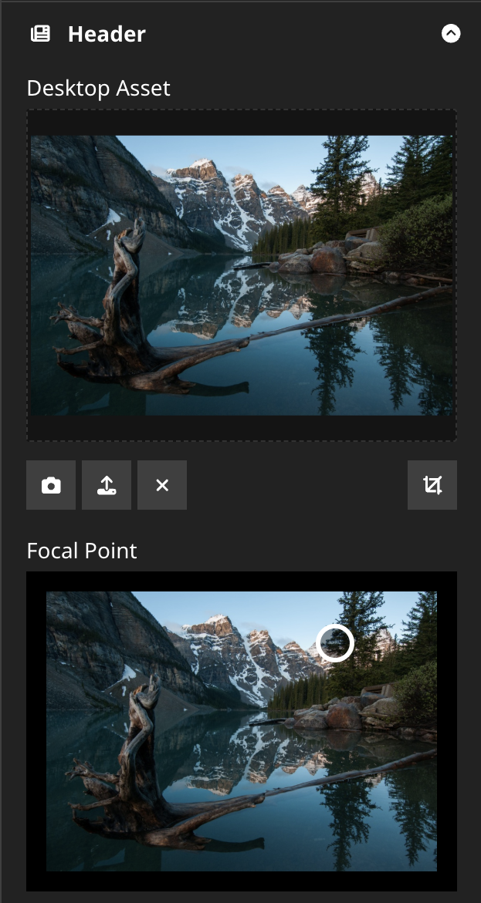

# Image Focal Point Editor for Neos CMS
[](https://packagist.org/packages/jvmtech/neos-imagefocalpointeditor)
[](https://packagist.org/packages/jvmtech/neos-imagefocalpointeditor)

A Neos CMS UI plugin that adds an interactive focal point editor for images in the Neos Inspector.

## What it does

This package registers a custom property editor in the Neos backend that allows editors to visually select a focal point on an image. The selected coordinates are stored as a JSON string `{"x": number, "y": number}` (integer pixel values) and can then be used in Fusion to influence image rendering or cropping.

The editor displays a scaled preview of the image (respecting any crop and resize adjustments applied in the media module) and lets the user click to place the focal point.

In general, the package can be used to provide a two-dimensional coordinate selector for various different purposes like positioning an element on top of an image at a chosen position.

## Requirements

- Neos UI `^9.0`

## Installation

Install via Composer:

```bash
composer require jvmtech/neos-imagefocalpointeditor
```

## Example



## Configuration

Add the editor to a node type property using the editor key `JvMTECH.Neos.ImageFocalPointEditor/ImageFocalPointEditor`:

```yaml
'Your.Package:YourNodeType':
  properties:
    focalPoint:
      type: string
      ui:
        label: 'Focal Point'
        inspector:
          group: 'image'
          editor: 'JvMTECH.Neos.ImageFocalPointEditor/ImageFocalPointEditor'
          editorOptions:
            imageProperty: 'image'
```

### Editor Options

| Option          | Type   | Description                                                                                                                                              |
|-----------------|--------|----------------------------------------------------------------------------------------------------------------------------------------------------------|
| `imageProperty` | string | The name of the image property on the same node to use as the preview. Prefix with `parent:` to reference a property on the parent node (e.g. `parent:image`). |

### Referencing a parent node's image

If the focal point property lives on a child node but the image is on the parent node, use the `parent:` prefix:

```yaml
editorOptions:
  imageProperty: 'parent:image'
```

## Stored value format

The property value is a JSON string with x/y coordinates as integer percentages (0–100):

```json
{"x": 42, "y": 30}
```

## Fusion: ObjectPosition augmenter

The package ships a ready-to-use Fusion prototype that applies the focal point as a CSS `object-position` inline style via `Neos.Fusion:Augmenter`:

```
prototype(JvMTECH.Neos.ImageFocalPointEditor:ObjectPosition)
```

It wraps any content and injects `style="object-position: {x}% {y}%;"`. When no focal point is set the value falls back to `initial`.

**Props**

| Prop          | Default           | Description                                      |
|---------------|-------------------|--------------------------------------------------|
| `focalPoint`  | `Neos.Fusion:DataStructure` (empty) | Parsed focal point object with `x` and `y` keys |
| `cssProperty` | `object-position` | CSS property name written into the style attribute |
| `content`     | —                 | The child markup to augment                      |

**Example usage**

```fusion
renderer = afx`
    <JvMTECH.Neos.ImageFocalPointEditor:ObjectPosition
        focalPoint={Json.parse(q(node).property('focalPoint'))}
    >
        <Neos.Neos:ImageTag asset={q(node).property('image')} />
    </JvMTECH.Neos.ImageFocalPointEditor:ObjectPosition>
`
```

## Development

The frontend source lives in `Resources/Private/Scripts/`. It is built with [esbuild](https://esbuild.github.io/) and outputs to `Resources/Public/ImageFocalPointEditor/`.

```bash
cd Resources/Private/Scripts

# Install dependencies
yarn install

# Production build
yarn build

# Watch mode
yarn watch
```

### Tech stack

- React + TypeScript
- Redux (connected to Neos UI store)
- [`@lemoncode/react-image-focal-point`](https://github.com/Lemoncode/react-image-focal-point) for the picker UI
- esbuild for bundling
